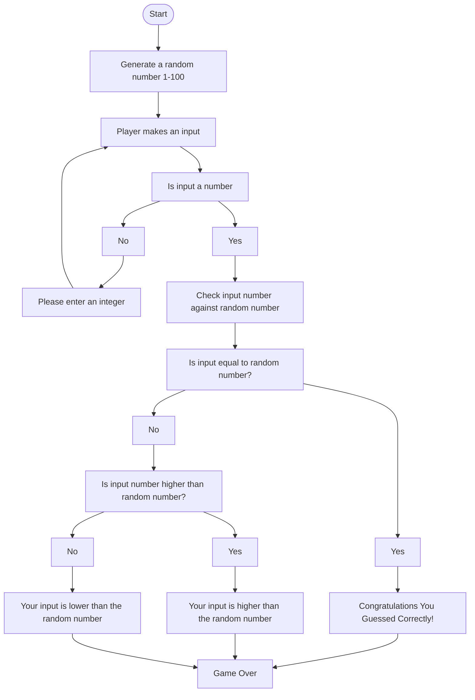

# Documentation

The first actions are to generate a number and pompt the user to select a number. Store both of these inputs. 

Check to see if the user inputed a integer, If they didn't and input something else like a character, prompt them again to input a number

Once it is checked that the input is an integer, check to see if it is the same number as the randomly generated number

If they are the same, game over they won. 

If not we have to check if it is higher or lower. I decided to just check if it is higher leaving the last option be lower.

Output a response accordingly, either way end of game.
